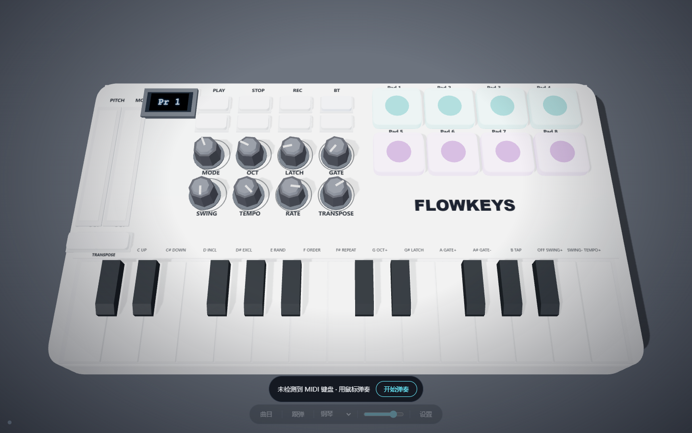
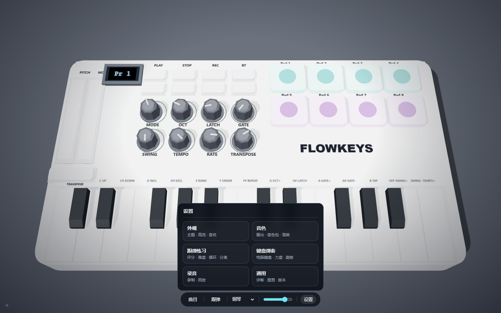
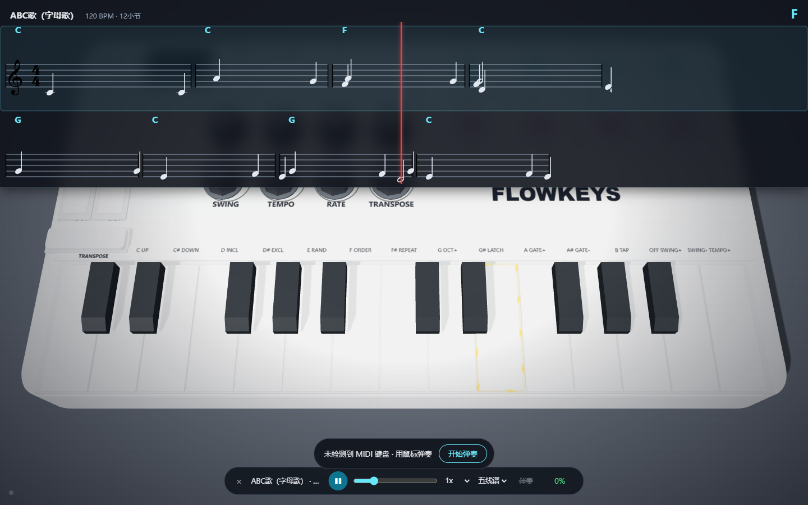

# FlowKeys 流光钢琴

[简体中文](README.zh-CN.md) ｜ [English](README.md) ｜ [한국어](README.ko.md) ｜ [日本語](README.ja.md) ｜ **Русский** ｜ [Español](README.es.md)

Настольное приложение для обучения игре на пианино с повторением за MIDI-клавиатурой: 3D-визуализация клавиш + ноты / цифровая запись / плитки + встроенный движок SoundFont (без хоста). Языки интерфейса: 简体中文 / English / 한국어 / 日本語 / Русский / Español.







## Возможности

**Игра**
- 3D-клавиатура (вращение мышью, зум колесом, клик — прослушать); клавиши подсвечиваются с подписями (ноты / сольфеджио / цифры / MIDI)
- Игра с PC-клавиатуры (A-K), ±2 октавы — MIDI-клавиатура не обязательна
- Чувствительность к силе нажатия; три кривые (мягкая / стандарт / жёсткая)
- 8 падов ударных, анимация ручек; индикатор педали сустейна

**Звук**
- Встроенный движок SoundFont (читает .sf2 напрямую): банк GeneralUser GS, 288 тембров с поиском и избранным
- Три режима вывода: встроенный синтез / банк SoundFont / внешний MIDI-порт (VST, DAW, железо)
- Загрузка любых локальных .sf2; реверберация SF2 (малая / средняя / большая)
- Естественное затухание как у пианино — ноты гаснут, а не тянутся бесконечно

**Практика**
- Библиотека: встроенные песни + пакетный импорт MIDI + онлайн-поиск (BitMidi)
- Четыре режима нотации: ноты / цифры / плитки / чистый повтор
- Режим повтора: в своём темпе, световой поток подсказывает следующую ноту
- 5 уровней сложности (допуск соседних клавиш); оценка и итоги (серии / звёзды)
- Цикл A-B, скорость 0.25x–1x, разделение рук (для импортированных песен с аккомпанементом)
- Запись и воспроизведение игры (включая педаль)

**Прочее**
- Настройки по категориям: вид / звук / практика / клавиатура / запись / общее
- Многоязычный интерфейс: 简体中文 / English / 한국어 / 日本語 / Русский / Español (Настройки → Общее → Язык; при первом запуске определяется язык системы)
- Четыре темы фона; копирование диагностики в один клик
- Все дополнительные функции по умолчанию выключены

## Загрузка

Последняя версия — в [Releases](../../releases):

| Файл | Описание |
| --- | --- |
| `FlowKeys-portable-vX.X.X.exe` | Портативная версия: запуск без установки |
| `FlowKeys-setup-vX.X.X.exe` | Установщик: меню «Пуск» и удаление |

Требуется Windows 10 / 11 (используется системный WebView2; для старых систем — [WebView2 Runtime](https://developer.microsoft.com/microsoft-edge/webview2/)).

> Приложение не подписано, поэтому при первом запуске SmartScreen может предупредить о неизвестном издателе — выберите «Подробнее → Выполнить в любом случае».

## Подсказки

- MIDI-клавиатура определяется автоматически; можно играть на PC-клавиатуре (A-K) или мышью
- Настройки → Звук: выберите банк SoundFont, ищите и добавляйте тембры в избранное; пады автоматически используют набор ударных
- «Песни» — оценка в темпе; «Повтор» — практика в своём темпе
- Настройки → Практика: оценка и итоги, цикл A-B, разделение рук

### Минусовки (опционально)

Для лёгкости репозитория и во избежание проблем с авторскими правами аудио песен (`app/songs/*.mp3`) не распространяется. Ноты работают сразу; для минусовки положите mp3 с тем же именем в `app/songs/` (например, `xiaoban.mp3`).

## Технологии

- Фронтенд: чистый JavaScript + [Three.js](https://threejs.org/) (3D-клавиатура) + [VexFlow](https://www.vexflow.com/) (ноты) + Web Audio / Web MIDI
- Настольная часть: Tauri 2 (Rust)
- Звук: собственный минимальный парсер/плеер SF2 (`app/src/sf2Player.js`) + встроенный синтез

## Структура проекта

```
app/                 Фронтенд (встраивается в desktop-сборку)
  index.html         Главная: 3D-клавиатура / настройки / запись / диагностика
  src/
    createKeyboardModel.js  Модель 3D-клавиатуры
    soundEngine.js          Встроенный синтез
    sf2Player.js            Движок SoundFont
    followPlay.js           Библиотека / нотация / повтор / импорт
    i18n.js                 Переводы UI (6 языков)
  songs/             Библиотека песен (нотация JSON; аудио — своё)
  sounds/            Встроенный саундфонт
src-tauri/           Оболочка (Rust / Tauri)
tests/               Дымовые тесты Playwright
docs/                Скриншоты
```

## Локальная разработка

Фронтенд (любой статический сервер):

```bash
python -m http.server 9200 --directory app
# откройте http://127.0.0.1:9200/index.html
```

Desktop (нужны Rust + MSVC):

```bash
cd src-tauri
cargo tauri dev      # режим разработки (сначала сервер на 9200)
cargo tauri build    # сборка установщика NSIS
```

## Тесты

В `tests/` — дымовые скрипты Playwright по функциям:

```bash
python -m http.server 9200 --directory app
node tests/features.js
```

## Контакты

- Кастомизация / запросы / обратная связь: **348741976@qq.com**
- Или [Issue](../../issues) на GitHub

## Лицензия и благодарности

Сторонние ресурсы (саундфонт, фреймворки) — в [CREDITS.md](CREDITS.md). Код — под лицензией [MIT](LICENSE).

> Дисклеймер: это личный учебный проект. Внешний вид и взаимодействие клавиатуры вдохновлены MIDI-клавиатурой **M-VAVE SMK-25** — в учебных целях и как дань уважения. Проект не связан с M-VAVE.
